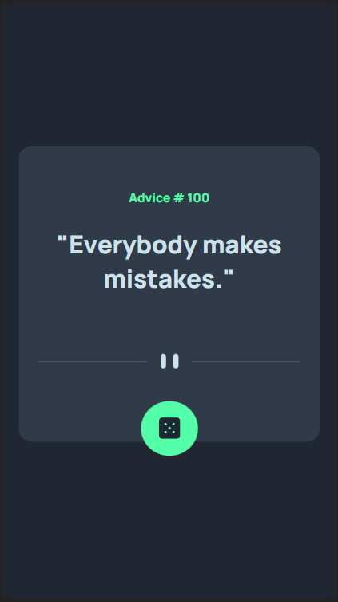

# Frontend Mentor - Advice generator app


# Frontend Mentor - Advice generator app solution

This is a solution to the [Advice generator app challenge on Frontend Mentor](https://www.frontendmentor.io/challenges/advice-generator-app-QdUG-13db). Frontend Mentor challenges help you improve your coding skills by building realistic projects.

## Table of contents

- [Overview](#overview)
  - [The challenge](#the-challenge)
  - [Screenshot](#screenshot)
  - [Links](#links)
- [My process](#my-process)
  - [Built with](#built-with)
  - [What I learned](#what-i-learned)
  - [Continued development](#continued-development)
  - [Useful resources](#useful-resources)
- [Author](#author)
- [Acknowledgments](#acknowledgments)

## Overview

### The challenge

Users should be able to:

- View the optimal layout for the app depending on their device's screen size
- See hover states for all interactive elements on the page
- Generate a new piece of advice by clicking the dice icon

### Screenshot


- Screenshot on Hover


- Screenshot ( Mobile )



### Links

- Solution URL: [https://github.com/the-bipu/Advice-Generator-App](https://github.com/the-bipu/Advice-Generator-App)
- Live Site URL: [https://advice-generator-app.glitch.me/](https://advice-generator-app.glitch.me/)

## My process

### Built with

- Semantic HTML5 markup
- CSS custom properties
- Flexbox
- CSS Grid
- Mobile-first workflow
- [Node](https://nodejs.org/en/docs) - JS library
- [Express](https://expressjs.com/) - JS library

### What I learned

- Tried keyframes for the first time.
```css
@keyframes glowing {
    0% {
        background-color: hsl(150, 100%, 66%);
        box-shadow: 0 0 5px hsl(150, 100%, 66%);
    }
    50% {
        background-color: hsl(150, 100%, 66%);
        box-shadow: 0 0 20px hsl(150, 100%, 66%);
    }
    100% {
        background-color: hsl(150, 100%, 66%);
        box-shadow: 0 0 5px hsl(150, 100%, 66%);
    }
}
```

- This is the first time i used the url and path field in my code and previously i have used the __dirname but this time i understand the concept of where it comes from.
```js
import { fileURLToPath } from 'url';
import path, { dirname } from 'path';

const app = express();
app.use(bodyParser.urlencoded({extended: true}));


const __filename = fileURLToPath(import.meta.url);
const __dirname = dirname(__filename);

app.use(express.static(__dirname + '/assets'));

// Set up views directory
app.set('views', path.join(__dirname, 'views'));
app.set('view engine', 'ejs');
```

### Continued development

This project is complete as per the given challenge. I don't want to update it more but in future if there was a need then i'll add a input box so that the user can search the advice by giving the advise id.

### Useful resources

- [MIME Error on Vercel](https://stackoverflow.com/questions/48248832/stylesheet-not-loaded-because-of-mime-type) - This helped me for fixing the issue of MIME. I really liked this article cause it's so frustrating when you check all the things and a little MIME error appears in your code.
- [For Deployment](https://jonathans199.medium.com/deploy-node-js-express-api-to-vercel-dbf4461795a5) - This is an amazing article which helped me finally understand the deployment of node apps using vercel. I'd recommend it to anyone still learning this concept.

## Author

- Github - [The-Bipu](https://github.com/the-bipu)
- Frontend Mentor - [@the-bipu](https://www.frontendmentor.io/profile/the-bipu)

## Acknowledgments

Until now i haven't seen the solution of any other person but i use chatGPT a lot when i need to debug a code section, or when i have to understand a concept.

